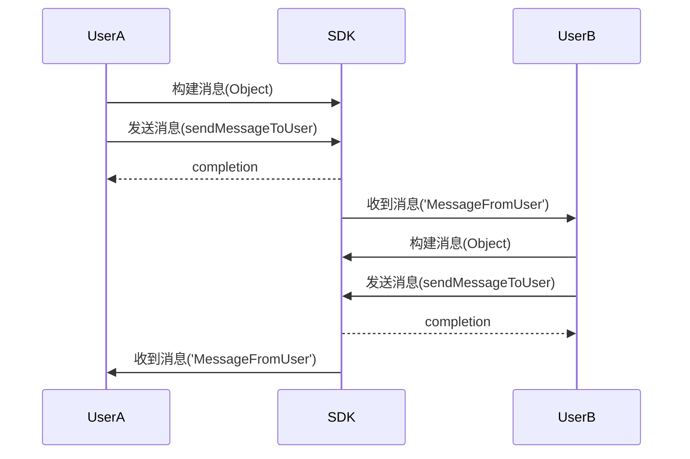
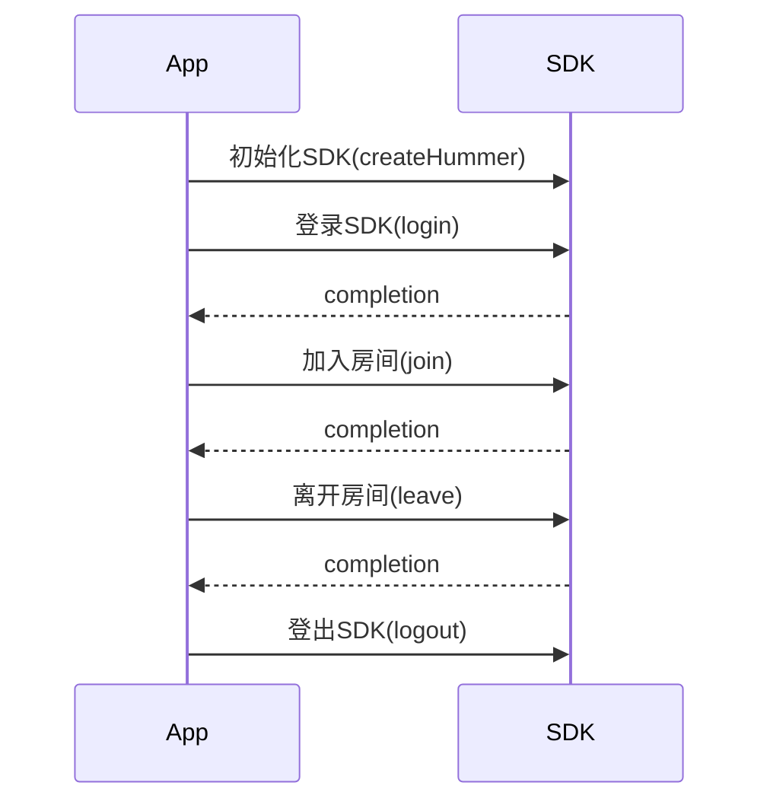
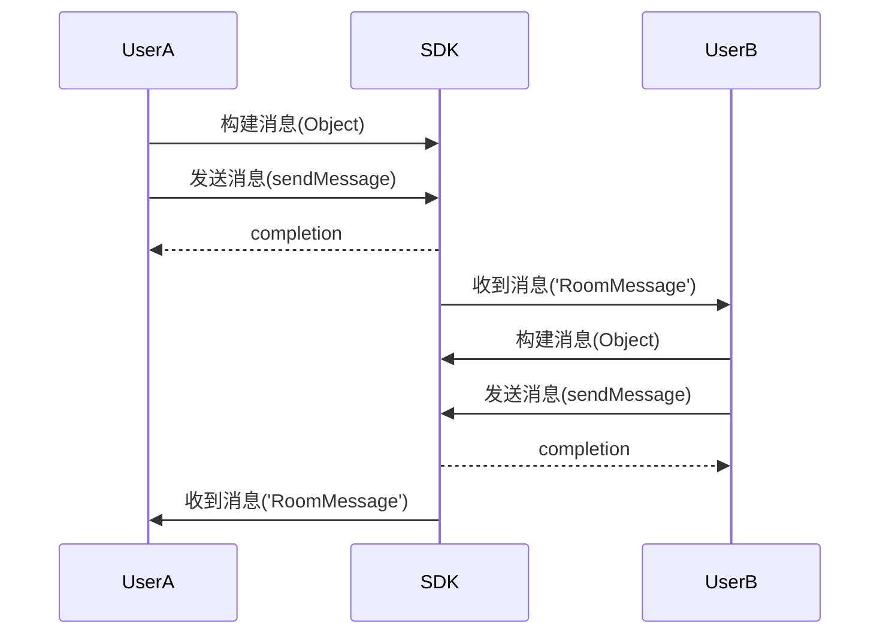

# 实时信令

本文介绍如何快速集成 Hummer SDK JS 版本到项目中的方法

## 1 Demo体验

开源的SDK示例项目：  
[Hummer-JS-VUE-DEMO](https://github.com/Aivacom/vue-room)

## 2 前提条件

-  Hummer sdk通过npm引入，需要开发者已经安装过nodejs
-  nodejs
-  Chrome浏览器
-  [注册开发者账号](http://www.aivacom.com)
-  [创建项目并获取APPID](/cn/platform/console/create_and_manage_projects/create_and_manage_projects.md)

## 3 准备开发环境

本节介绍如何创建项目，并将 Hummer SDK 集成至你的项目中。

### 3.1 步骤一：创建项目

uid和token生成方法详见：
https://www.sunclouds.com/cloud/v2/developer/doc.htm?serviceId=102&typeCode=FAQ&title=Python&version=2.0&parentId=852

参照vue-room开发前端业务逻辑代码
https://github.com/Aivacom/vue-room

### 3.2 步骤二：引入库文件

https://www.npmjs.com/package/hummer-rts-sdk

npm install hummer-rts-sdk

```javascript
import Hummer from 'humer-rts-sdk'
```


## 4 基本操作

本节介绍如何使用SDK提供的基本功能。

### 4.1 初始化、登录

#### 4.1.1 步骤一：初始化Hummer SDK

在调用 Hummer API 前，需要初始化 Hummer SDK，以保证 SDK 各个组件之间能够初始化完成并且保证SDK能够正常工作。调用 createHummer 方法，即可初始化 Hummer SDK。

```javascript
// appId 是服务平台为应用程序开发者签发的 AppId
// 需要的入参包括：appid等信息；
hummer = Hummer.createHummer({appid});

```

#### 4.1.2 步骤二：登录SDK

由于整个 SDK 依赖于用户登录才能使用，所以需要业务在初始化 SDK 后调用 login 方法告知用户的 uid 以及对应的一些信息保证 SDK 鉴定对应用户的合法性以及建立对应的用户上下文。

```javascript
// uid 用户 id, uid不能为0
// region 区域配置参数
// token 该参数为鉴定用户合法性的票据
hummer.login({ region, uid, token });
```

### 4.2 实时信令消息使用方法

信令消息的 API 调用时序见下图：

#### 收发点对点信令消息



Hummer SDK 提供发送、接收点对点信令消息的API，使用方式如下：

#### 4.2.1 步骤一：添加消息监听器

```javascript

//添加信令消息的监听器

 // 当收到P2P信令消息时，会收到该事件的通知回调
 // message    收到的信令消息
 // user       发送者
 //
client.on('MessageFromUser', (data) => { console.log(data); });
```

#### 4.2.2 步骤二：发送P2P信令消息

Hummer SDK 提供发送点对点信令消息的API，使用方式如下：

```javascript


// 发送P2P信令消息
client.sendMessageToUser({})；
```

### 4.3 房间API使用方法

房间的 API 调用时序见下图：

#### 登录登出房间



#### 房间内收发消息



#### 4.3.1 步骤一：加入房间

目前房间支持单端以及多端进入房间，对应具体的配置可以找后台的相关同学进行对应的配置。对于单端进入房间则第二个进入房间的用户会将第一个进入房间的用户踢出房间。使用 join 可以加入房间。

```javascript
//
// 进入房间的接口
// promise    回调
room.join();
```

#### 4.3.2 步骤二：房间内发送消息

消息通道支持多种消息类型，可以通过消息通道发送房间消息。业务只需要在 HMRMessage 的对象中填入对应类型的消息类型既可以。使用 sendMessage 方法可以发送消息。

```javascript

// 发送房间消息
// msg    需要发送的信令消息
// promise 发送操作的完成回调
//
let params = { type, content }
room.sendMessage(params).then(res => {
  console.log("res: " + JSON.stringify(res));
}).catch(err => {
  console.log(err);
})
```

#### 4.3.3 步骤三：接收消息

可以在 监听事件'RoomMessage' 回调方法中接收消息。在接收到对应的消息后，业务可以根据对应的收到消息的类型以及对应的信息来进行业务处理。

```javascript

// 添加事件监听

// 当有一个用户往房间内发一条信令消息时，房间内所有的成员都会受到该事件的通知回调
// message       收到的信令消息
room.on('RoomMessage', (data) => { console.log(data); })
```

#### 4.3.4 步骤四：离开房间

在进入房间后处理完所有需要处理的逻辑后，可以通过 leaveRoom 方法离开房间来结束跟房间之间的交互，同时也会停止监听房间的信令消息和对应的回调通知。

```javascript
// 退出房间的接口
// promise    回调
room.leave();
```

### 4.4 退出SDK

退出登录 SDK，用于告知 SDK 当前用户已经退出登录了，保证 SDK 即使回收对应的资源。使用 logout 方法退出登录。

```javascript
// 登出用户上下文
// 该操作应该在业务进行实际的用户注销（退出登录）之前执行
hummer.logout();
```

## 5 API参考

这里写文中涉及的所有api列表。
-   [createHummer](/cn/product_category/rtm_service/instant_messaging/api/JS/v3.1.3/function.html#Hummer::createHummer)
-   [login](/cn/product_category/rtm_service/instant_messaging/api/JS/v3.1.3/function.html#Hummer::login)
-	[sendMessageToUser(P2P)](/cn/product_category/rtm_service/instant_messaging/api/JS/v3.1.3/function.html#Hummer::sendMessageToUser)
-	[MessageFromUser](/cn/product_category/rtm_service/instant_messaging/api/JS/v3.1.3/notification.html#Humer::on:MessageFromUser)
-   [join](/cn/product_category/rtm_service/instant_messaging/api/JS/v3.1.3/function.html#Hummer::RtsRoom:join)
-   [leave](/cn/product_category/rtm_service/instant_messaging/api/JS/v3.1.3/function.html#Hummer::RtsRoom:leave)
-   [sendMessage(房间消息)](/cn/product_category/rtm_service/instant_messaging/api/JS/v3.1.3/function.html#HMRRoomService::sendMessage)
-   [RoomMessage](/cn/product_category/rtm_service/instant_messaging/api/JS/v3.1.3/notification.html#####Humer::on:RoomMessage)
-   [logout](/cn/product_category/rtm_service/instant_messaging/api/JS/v3.1.3/function.html#Hummer::logout)

## 6 注意事项


